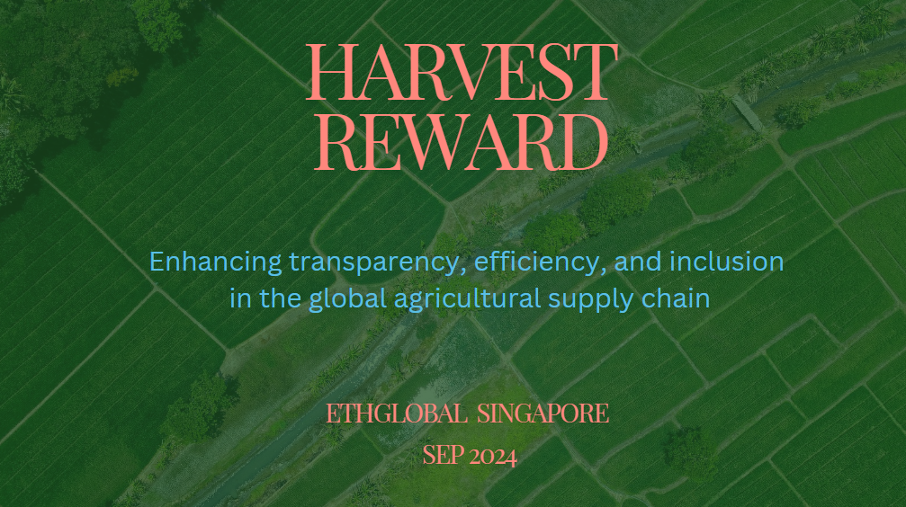

# HarvestReward
HarvestReward is a decentralized platform designed to transform the agricultural supply chain using blockchain technology. Built on Hedera Hashgraph, the platform offers secure, transparent, and efficient solutions for farmers, cooperatives, buyers, agribusinesses, and regulators. HarvestReward enables seamless information sharing, product traceability, and automated financial transactions through smart contracts, while fostering sustainability and financial inclusion.

# Key Features
## Supply Chain Transparency
Track agricultural products from farm to consumer using an immutable ledger that ensures transparency and traceability at every step of the supply chain.

## Smart Contracts
Automate agreements between farmers, buyers, logistics providers, and other stakeholders. Contracts automatically trigger payments, logistics updates, and insurance payouts based on predefined conditions.

## Decentralized Finance (DeFi)
Farmers can access microloans, insurance, and decentralized payments using tokenized assets like future crop yields. This feature supports financial inclusion, particularly for smallholder farmers in underserved regions.

## IoT Integration
Real-time data from IoT devices, such as soil moisture sensors and weather data, is integrated into the blockchain to provide actionable insights and ensure accurate contract execution.

## Tokenization
Crop yields, livestock, and environmental assets like carbon credits can be tokenized, allowing fractional ownership and easier trading on global markets.

# Technology Stack
## Hedera Hashgraph
Powers the platform with its high throughput, low transaction costs, and energy-efficient consensus mechanism, ensuring secure and scalable transactions.

## Worldcoin
Provides decentralized identity (DID) verification for farmers and stakeholders, ensuring secure and inclusive access to the platform, enhancing trust and preventing identity fraud.

## Chainlink Oracles
Integrates real-world data, such as weather conditions and logistics updates, into the blockchain, enabling accurate and reliable execution of smart contracts.

# Presentation

